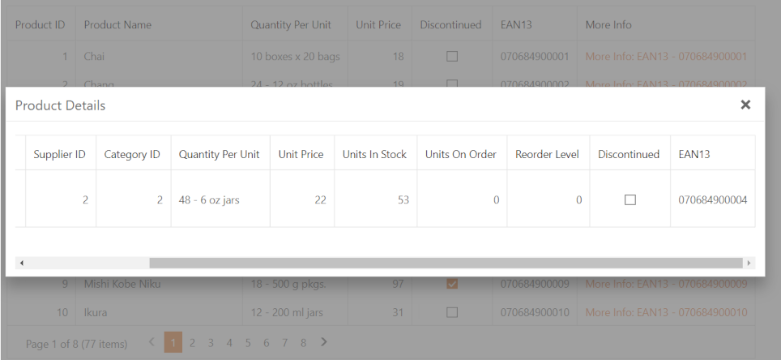

<!-- default badges list -->

[](https://supportcenter.devexpress.com/ticket/details/E2270)
[](https://docs.devexpress.com/GeneralInformation/403183)
<!-- default badges end -->
# Grid View for ASP.NET Web Forms - How to show a popup when a user clicks a hyperlink in a grid column's DataItemTemplate
<!-- run online -->
**[[Run Online]](https://codecentral.devexpress.com/134059510/)**
<!-- run online end -->

This example shows how to create a grid that contains hyperlinks in one of its column's [DataItemTemplate](https://docs.devexpress.com/AspNet/DevExpress.Web.GridViewDataColumn.DataItemTemplate). When a user clicks a hyperlink, a popup dialog ([ASPxPopupControl](https://docs.devexpress.com/AspNet/DevExpress.Web.ASPxPopupControl)) is shown.



## Implementation Details

In this example, the Popup Control's [ContentUrl](http://documentation.devexpress.com/#AspNet/DevExpressWebASPxPopupControlASPxPopupControl_ContentUrltopic) property value is calculated in the [ASPxHyperLink](https://docs.devexpress.com/AspNet/DevExpress.Web.ASPxHyperLink._members)'s [Init](https://docs.microsoft.com/en-us/dotnet/api/system.web.ui.control.init?view=netframework-4.8) event handler based on a data row's field value and the base URL value stored in the session.

The handler builds a JavaScript function that assigns the calculated `ContentUrl` value to the Popup Control on the client when a user clicks the link:

```cs
protected void hyperLink_Init(object sender, EventArgs e) {
    ASPxHyperLink link = (ASPxHyperLink)sender;

    GridViewDataItemTemplateContainer templateContainer = (GridViewDataItemTemplateContainer)link.NamingContainer;

    int rowVisibleIndex = templateContainer.VisibleIndex;
    string ean13 = templateContainer.Grid.GetRowValues(rowVisibleIndex, "EAN13").ToString();
    string contentUrl = string.Format("{0}?EAN13={1}", Session["baseURL"], ean13);

    link.NavigateUrl = "javascript:void(0);";
    link.Text = string.Format("More Info: EAN13 - {0}", ean13);
    link.ClientSideEvents.Click = string.Format("function(s, e) {{ OnMoreInfoClick('{0}'); }}", contentUrl);
}
```

## Files to Look At

- [Default.aspx](./CS/Solution/Default.aspx) (VB: [Default.aspx](./VB/Solution/Default.aspx))
- [Default.aspx.cs](./CS/Solution/Default.aspx.cs) (VB: [Default.aspx.vb](./VB/Solution/Default.aspx.vb))
- [Products.aspx](./CS/Solution/Products.aspx) (VB: [Products.aspx](./VB/Solution/Products.aspx))
- [Products.aspx.cs](./CS/Solution/Products.aspx.cs) (VB: [Products.aspx.vb](./VB/Solution/Products.aspx.vb))

## Documentation
- [Popup Control](https://docs.devexpress.com/AspNet/3582/components/docking-and-popups/popup-control)


## More Examples
- [Popup Control for ASP.NET Web Forms - How to show a pop-up window](https://github.com/DevExpress-Examples/web-forms-show-popup-window)
- [Popup Control for ASP.NET Web Forms - How to show and hide a pop-up window on the server side](https://github.com/DevExpress-Examples/asp-net-web-forms-popup-change-visibility)
- [Grid View for ASP.NET MVC - How to display a hyperlink in a templated column](https://github.com/DevExpress-Examples/mvc-gridview-display-hyperlink-in-templated-column)
- [Grid View for ASP.NET Web Forms - How to display a popup dialog when a user clicks a link in a grid row](https://www.devexpress.com/Support/Center/p/e2193)
